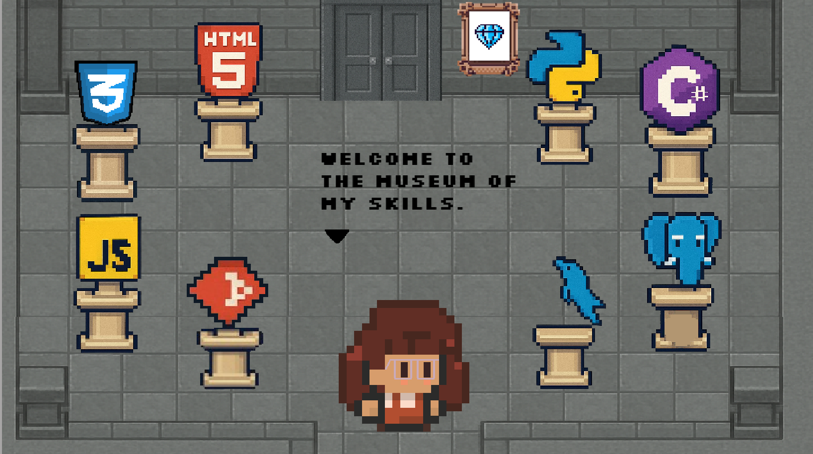
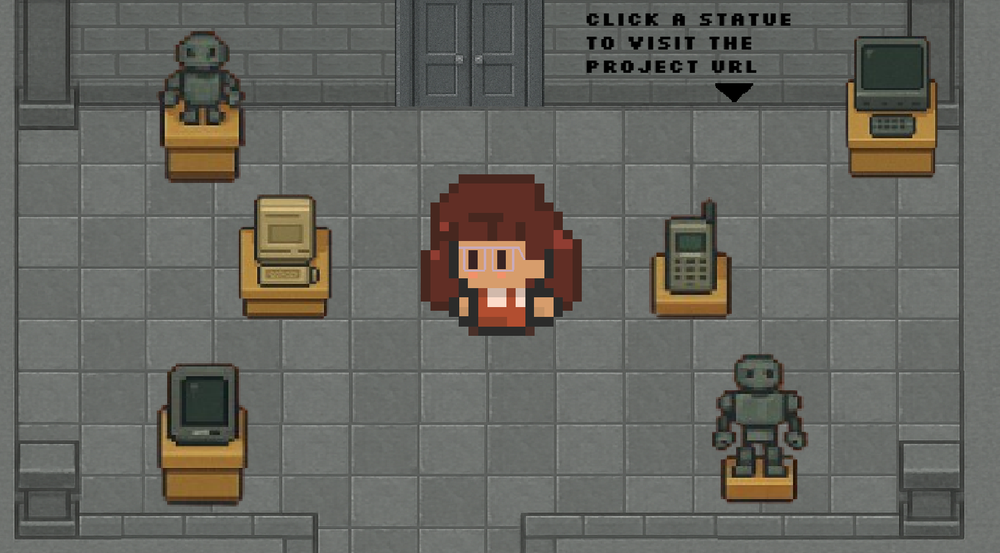
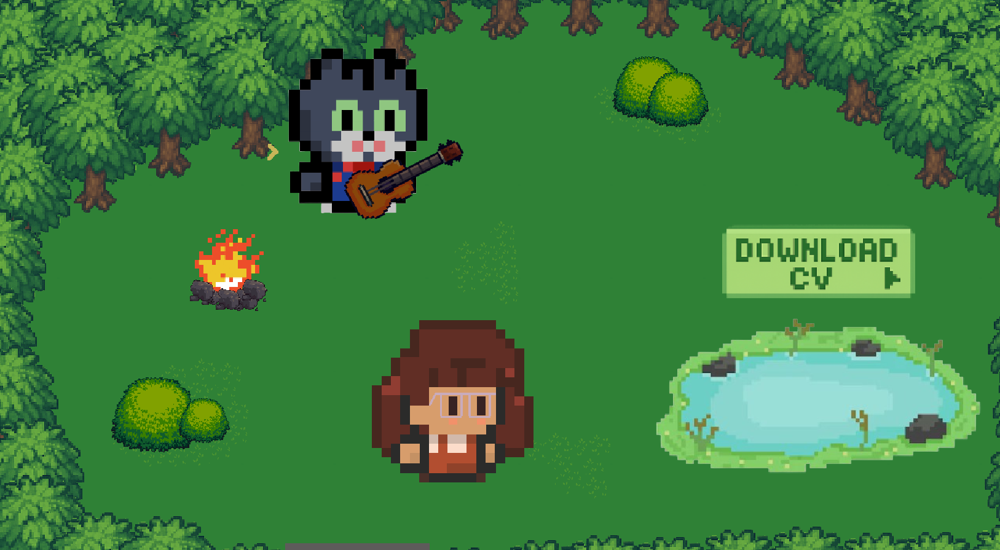

# Portfolio - Merli Ariza
https://merliariza.github.io/portafolio-merliariza/

## Description

This is my responsive and interactive portfolio website that showcases my skills, experience, and projects as a software developer. This portfolio allows users to explore my skills and projects through an engaging, game-like experience. Each section is represented as a different scene within the game, where players can interact with objects to discover more about me, my work, and how to contact me.

## Features

- **Dynamic Landing Page:** A visually engaging introduction with animations.
- **About Me Section:** The scene provides a brief overview of who I am and my journey into the world of software development.
- **Skills Museum:** This scene is like a museum, showcasing statues representing different skills that I have shaped throughout my career.
- **Technology Collection Hall:** In this section, the player encounters statues representing my different technology-related projects. By clicking on each statue, users will be redirected to the respective GitHub repository for more details on the project.
- **Contact Section:** The final section provides a way for users to contact me directly. There's a button that links to my resume (CV), where users can view my professional background.

## Technologies Used

  - CSS: For styling the different scenes and elements to ensure a polished and responsive design.
  - HTML: For structuring the content and ensuring accessibility across different devices.
  - JavaScript: For interactive elements, such as clicking on statues to display descriptions and redirecting to external links.
  - GDevelop: Used for creating the interactive game scenes and gameplay logic.

### How to play:
  - Navigate through the different scenes using your mouse or keyboard.
  - Click on the statues in the Skills Museum and Technology Collection Hall to learn more about my skills and projects.
  - Use the Contact section to view my resume and get in touch with me.

### Design:
- **Cover**
  

- **Merli Ariza**
  

- **About me**
  

- **My projects**
  

- **Contact me** 
  

### Autor:
- This project is created by Merli Ariza.
